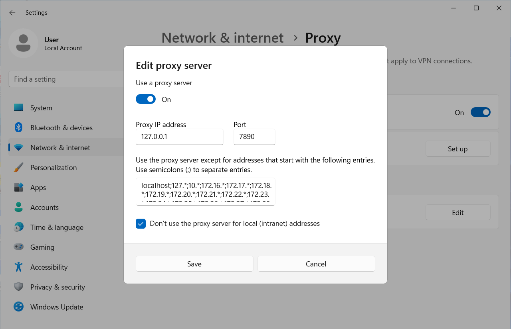
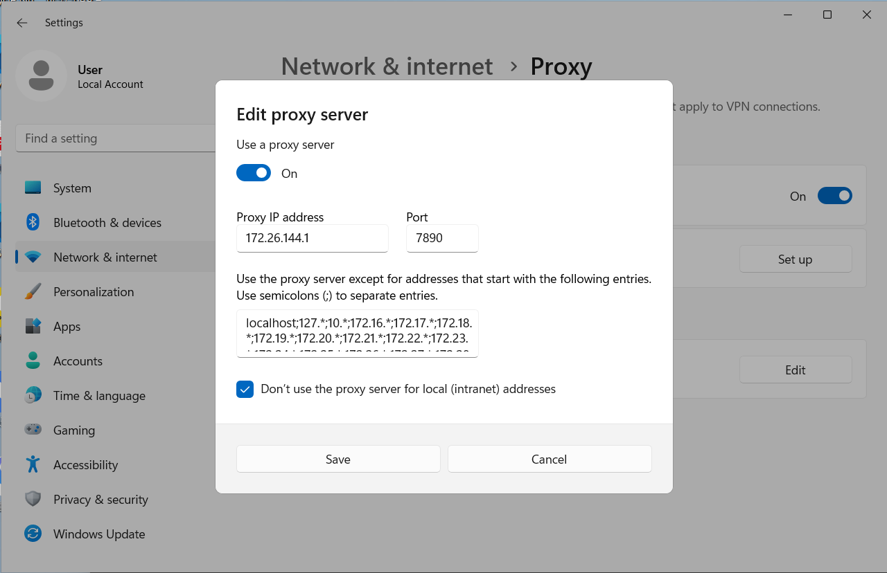
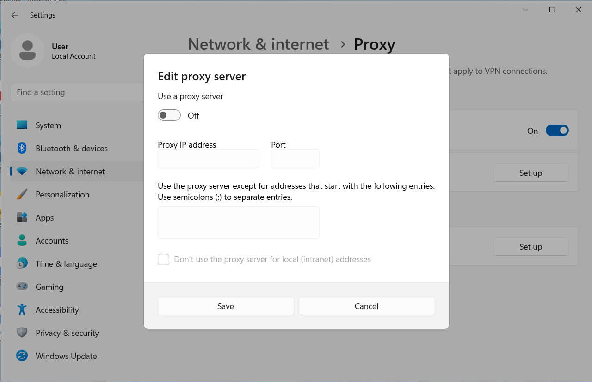
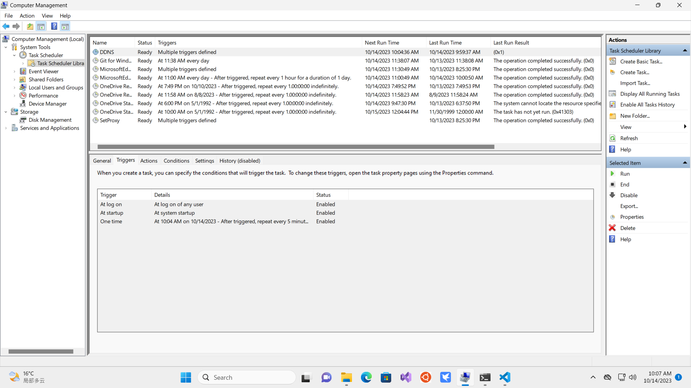

The PowerShell module `PSComputerManagementZp` can help users realize many common management operations easily on Windows PCs.

On this page, there are some perhaps useful samples or usages with the module `PSComputerManagementZp`.

# About Windows or WSL2 System Proxy

**Fundamental**: Modify `Current User` level registry items  `HKCU:\Software\Microsoft\Windows\CurrentVersion\Internet Settings` to set and unset system level proxy.

## Set system proxy IPV4 by `Localhost` with `PortNumber`

Please run PowerShell with `Administrator` privilege. 

Supposing the port number is `7890`, the following commands will automatically detect the IPV4 of localhost and then set the system proxy as 'localhost:7890':

```powershell
#Requires -Version 7.0
#Requires -RunAsAdministrator
Import-Module PSComputerManagementZp -Scope Local -Force
$server_ip = Get-LocalHostIPV4
Set-SystemProxyIPV4ForCurrentUser -ServerIP $server_ip -PortNumber 7890
Remove-Module PSComputerManagementZp
```

Then, open `Windows Settings->Network & Internet->Proxy` for checking:



## Set system proxy IPV4 by `Gateway` with `PortNumber`

This case can be useful when you want to set your `Virtual Machine`'s system proxy and your `Host Machine` has already been proxied. The specific situations are as follows:

- The `Host Machine` is running and has been proxied.
- The `Host Machine` has detected the `Virtual Machine`'s  `Network Adapter`, such as `vEthernet (Default Switch)`.
- The `Host Machine` has enabled `LAN proxy`.
- The `Virtual Machine`'s gateway IP address is just the above adapter's IP address.

Then, by following the settings on the `Virtual Machine`, it can through its gateway use `Host` Machine`'s system proxy.

### On virtual Windows

Please run PowerShell with `Administrator` privilege.  

Supposing the port number is `7890`, the following commands will automatically detect the IPV4 of the gateway and then set the system proxy as 'gateway:7890':

```powershell
#Requires -Version 7.0
#Requires -RunAsAdministrator
Import-Module PSComputerManagementZp -Scope Local -Force
$server_ip = Get-GatewayIPV4
Set-SystemProxyIPV4ForCurrentUser -ServerIP $server_ip -PortNumber 7890
Remove-Module PSComputerManagementZp
```

Then, open `Windows Settings->Network & Internet->Proxy` for checking:



Optional: To inject these commands into the `virtual Windows` as a scheduled task `SetProxy`, setting proxy automatically when `logon` or `startup`, you can take the following further commands (Please run PowerShell with `Administrator` privilege.) :

```powershell
#Requires -Version 7.0
#Requires -RunAsAdministrator
$commands = {
Import-Module PSComputerManagementZp -Scope Local -Force
$server_ip = Get-GatewayIPV4
Set-SystemProxyIPV4ForCurrentUser -ServerIP $server_ip -PortNumber 7890
Remove-Module PSComputerManagementZp
}
$triggers = @((New-ScheduledTaskTrigger -AtLogon), (New-ScheduledTaskTrigger -AtStartup))
$actions = @((New-ScheduledTaskAction -Execute "${Env:ProgramFiles}\PowerShell\7\pwsh.exe" -Argument "-WindowStyle Hidden -Command $commands"))
Register-ScheduledTask -TaskName "SetProxy" -Trigger $triggers -Action $actions -RunLevel Highest -Force
Stop-ScheduledTask -TaskName "SetProxy" 
Start-ScheduledTask -TaskName "SetProxy"
```

Then, open `Computer Management->System Tools->Task Scheduler->Task Scheduler Library->SetProxy` for checking:


### On WSL2

Just set the env level proxy. But first, installation of PowerShell and this module is also needed on Wsl2.

- Install PowerShell on WSL2, see the [official tutorials (install PowerShell on Ubuntu)](https://learn.microsoft.com/en-us/powershell/scripting/install/install-ubuntu?view=powershell-7.3#installation-via-package-repository):

  ```bash
  # Update the list of packages
  sudo apt-get update
  # Install pre-requisite packages.
  sudo apt-get install -y wget apt-transport-https software-properties-common
  # Download the Microsoft repository GPG keys
  wget -q "https://packages.microsoft.com/config/ubuntu/$(lsb_release -rs)/packages-microsoft-prod.deb"
  # Register the Microsoft repository GPG keys
  sudo dpkg -i packages-microsoft-prod.deb
  # Delete the the Microsoft repository GPG keys file
  rm packages-microsoft-prod.deb
  # Update the list of packages after we added packages.microsoft.com
  sudo apt-get update
  # Install PowerShell
  sudo apt-get install -y powershell
  # Start PowerShell
  pwsh
  ```

- Install this module on Wsl2's PowerShell:

  ```powershell
  # if in bash
  git clone git@github.com:Zhaopudark/PSComputerManagementZp.git
  cd PSComputerManagementZp
  pwsh -f ./install.ps1
  ```

- Set env level proxy. Supposing the port number is `7890`, the following commands will automatically detect the IPV4 of the gateway and then set the env proxy as 'gateway:7890':

  ```powershell
  # if has call pwsh from bash
  Import-Module PSComputerManagementZp -Force -Scope Local
  Set-EnvProxyIPV4ForShellProcess -ServerIP $(Get-GatewayIPV4) -PortNumber 7890
  Remove-Module PSComputerManagementZp
  ```

- Checking as:

  ```powershell
  Get-ChildItem -Path "Env:*proxy*"
  ```

  The results can be as:

  

- If want to remove these env proxy settings, you can do as:

  ```powershell
  # if has call pwsh from bash
  Import-Module PSComputerManagementZp -Force -Scope Local
  Remove-EnvProxyIPV4ForShellProcess
  Remove-Module PSComputerManagementZp
  ```

## Remove the settings for the system proxy

Please run PowerShell with `Administrator` privilege. 

Supposing  you have run the above commands to set the system proxy, you can do the following to revoke the settings:

```powershell
#Requires -Version 7.0
#Requires -RunAsAdministrator
Import-Module PSComputerManagementZp -Scope Local -Force
Remove-SystemProxyIPV4ForCurrentUser
Remove-Module PSComputerManagementZp
```

Then, open `Windows Settings->Network & Internet->Proxy` for checking:



# About Reset Authorization on Windows

For more information on the motivation, rationale, logic, and usage of function `Reset-Authorization`, see the [post](https://little-train.com/posts/7fdde8eb.html)

Please run PowerShell with `Administrator` privilege. 

Supposing  you have re-installed the Windows system on drive `C:\`, and you have remained old items, such as user data but established in the last system, in drive  `D:\`,  you can run the following commands to reset authorization of all items in `D:\` to get access to all of then automatically, instead of manual operations:

```powershell
#Requires -Version 7.0
#Requires -RunAsAdministrator
Import-Module PSComputerManagementZp -Scope Local -Force
Reset-Authorization 'D:\'
Remove-Module PSComputerManagementZp
```

For more safety, you can add `try-catch` syntax as:

```powershell
#Requires -Version 7.0
#Requires -RunAsAdministrator
try {    
    Import-Module PSComputerManagementZp -Scope Local -Force
    Reset-Authorization 'D:\'
    Remove-Module PSComputerManagementZp
}
catch {
    Write-Log  "Set-Authorization Exception: $PSItem"
    Write-Log  "Operation has been skipped on $Path."
}
```

# About IPv6 DDNS for Aliyun on Windows

With the help of [aliyun/aliyun-cli](https://github.com/aliyun/aliyun-cli), recently, this module can help to set IPv6 `DDNS` for Aliyun on Windows, and register it to Windows scheduled task. The restriction is it can only set very simple IPv6 `DDNS` configuration with `DomainName` and `RecordName`. Other configuration will be in default as those in [Aliyun DNS API](https://help.aliyun.com/document_detail/124923.html).

Here are the steps:

- Run PowerShell with `Administrator` privilege. 

- Install this module [Zhaopudark/PSComputerManagementZp](https://github.com/Zhaopudark/PSComputerManagementZp).

  ```powershell
  git clone git@github.com:Zhaopudark/PSComputerManagementZp.git
  cd PSComputerManagementZp
  ./install.ps1
  ```

  Make sure the version is at least v0.0.4:

  ```powershell
  (Get-Module -Name PSComputerManagementZp).Version -ge [System.Version]::new("0.0.4")
  # should be $true
  ```

- Install [aliyun/aliyun-cli](https://github.com/aliyun/aliyun-cli) as:

  ```powershell
  winget search aliyun-cli
  winget install --id Alibaba.AlibabaCloudCLI 
  ```

- Restart PowerShell with `Administrator` privilege.

- Provided your target IPv6 is with `xxx 以太网` adapter and begin with `240e`, domain `xxx.xxx` and record is `abc`.

  ```powershell
  
  $commands = {
  Import-Module PSComputerManagementZp -Scope Local -Force
  $ipv6 = (Get-TemporaryIPV6ByPattern -AdapterPattern '以太网' -AdressPattern '^240e:')
  Add-OrUpdateDnsDomainRecord4Aliyun -DomainName 'xxx.xxx' -RecordName 'abc' -RecordType AAAA -RecordValue $ipv6
  Remove-Module PSComputerManagementZp
  }
  
  $triggers = @(New-ScheduledTaskTrigger -AtLogon)
  $triggers += New-ScheduledTaskTrigger -AtStartup
  $triggers += New-ScheduledTaskTrigger -Once -At (Get-Date).AddMinutes(5) -RepetitionInterval (New-TimeSpan -Minutes 5)
  
  $action = New-ScheduledTaskAction -Execute "${Env:ProgramFiles}\PowerShell\7\pwsh.exe" -Argument "-NoProfile -WindowStyle Hidden -Command $commands"
  
  $user_id = [Security.Principal.WindowsIdentity]::GetCurrent().User.Value
  $principal =  New-ScheduledTaskPrincipal -UserId $user_id -LogonType S4U -RunLevel Highest
  
  $settings = New-ScheduledTaskSettingsSet -StartWhenAvailable
  
  Register-ScheduledTask -TaskName "DDNS" -Action $action -Principal $principal -Settings $settings -Trigger $triggers -Force 
  
  Stop-ScheduledTask -TaskName "DDNS" 
  Start-ScheduledTask -TaskName "DDNS"
  
  ```

- Then, open `Computer Management->System Tools->Task Scheduler->Task Scheduler Library->DDNS` for checking:

  

  