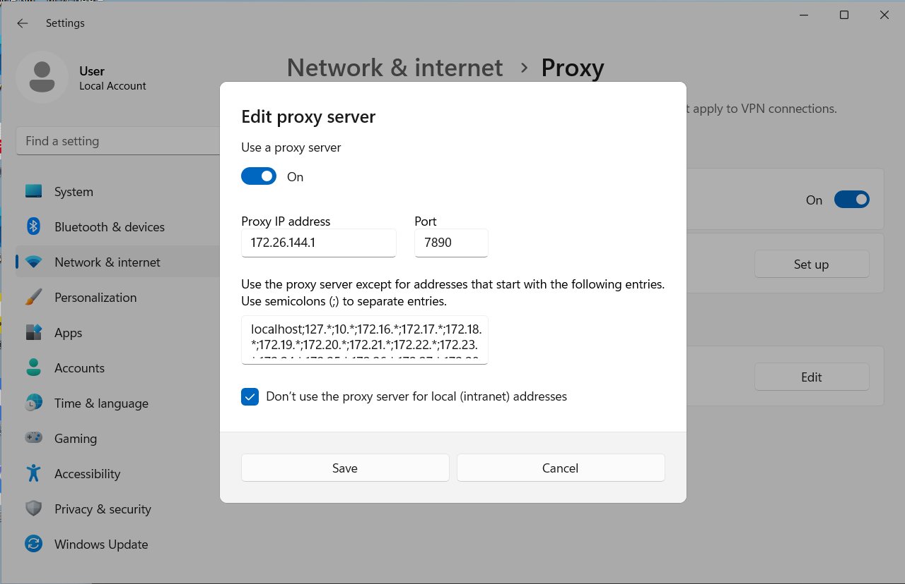

The PowerShell module `PSComputerManagementZp` can help users to realize many common management operations easily on Windows PCs. 

In this page, there are some perhaps useful samples or usages with the module `PSComputerManagementZp`.

# About Windows or WSL2 System Proxy

**Fundamental**: Modify `Current User` level registry items  `HKCU:\Software\Microsoft\Windows\CurrentVersion\Internet Settings` to set and unset system level proxy.

## Set system proxy IPV4 by `Localhost` with `PortNumber`

Please run PowerShell with `Administrator` privilege. 

Supposing the port number is `7890`, the following commands will automatically detect the IPV4 of localhost and then set system proxy by as 'localhost:7890':

```powershell
$module = Get-Module -ListAvailable | Where-Object {$_.Name -eq 'PSComputerManagementZp'}
$script_path = "$($module.Path | Split-Path -Parent)\samples\SetSystemProxy.ps1"
& $script_path -ServerType 'localhost' -PortNumber 7890
```

Then, open `Windows Settings->Network & Internet->Proxy` for checking:


## Set system proxy IPV4 by `Gateway` with `PortNumber`

This case can be useful when you want to set your `Virtual Machine`'s system proxy and your `Host Machine` has already been proxied. The specific situations are as follows:

- `Host Machine` is running and has been proxied.
- `Host Machine` has detect the `Virtual Machine`'s  `Network Adapter`, such as `vEthernet (Default Switch)`
- `Host Machine` has enable `LAN proxy`.
- `Virtual Machine`'s gateway IP address is the above adapter' IP address.

Then, by following settings on the `Virtual Machine`, it can through its gateway to use `Host Machine`'s system proxy.

### On virtual Windows

Please run PowerShell with `Administrator` privilege.  

Supposing the port number is `7890`, the following commands will automatically detect the IPV4 of gateway and then set system proxy by as 'gateway:7890':

```powershell
$module = Get-Module -ListAvailable | Where-Object {$_.Name -eq 'PSComputerManagementZp'}
$script_path = "$($module.Path | Split-Path -Parent)\samples\SetSystemProxy.ps1"
& $script_path -ServerType 'gateway' -PortNumber 7890
```

Then, open `Windows Settings->Network & Internet->Proxy` for checking:



Optional: To inject this script `SetSystemProxy.ps1` into the the `virtual Windows` as a scheduled task `SetProxy`, setting proxy automatically when `logon` or `startup` , you can take the following further commands (Please run PowerShell with `Administrator` privilege.) :

```powershell
Set-ExecutionPolicy RemoteSigned
$module = Get-Module -ListAvailable | Where-Object {$_.Name -eq 'PSComputerManagementZp'}
$script_path = "$($module.Path | Split-Path -Parent)\samples\SetSystemProxy.ps1"

Stop-ScheduledTask -TaskName "SetProxy"
Import-Module PSComputerManagementZp -Scope Local -Force
Register-PS1ToScheduledTask -TaskName "SetProxy" -ScriptPath $script_path -ScriptArgs "-ServerType Gateway -PortNumber 7890" -AtLogon -AtStartup
Start-ScheduledTask -TaskName "SetProxy"
Remove-Module PSComputerManagementZp
```

Then, open `Computer Management->System Tools->Task Scheduler->Task Scheduler Library->SetProxy` for checking:


### On WSL2

Just set env level proxy. But first, installation of PowerShell and this module is also need on Wsl2.

- Install PowerShell on WSL2, see the [official tutorials (install PowerShell on Ubuntu)](https://learn.microsoft.com/en-us/powershell/scripting/install/install-ubuntu?view=powershell-7.3#installation-via-package-repository) as:

  ```bash
  # Update the list of packages
  sudo apt-get update
  # Install pre-requisite packages.
  sudo apt-get install -y wget apt-transport-https software-properties-common
  # Download the Microsoft repository GPG keys
  wget -q "https://packages.microsoft.com/config/ubuntu/$(lsb_release -rs)/packages-microsoft-prod.deb"
  # Register the Microsoft repository GPG keys
  sudo dpkg -i packages-microsoft-prod.deb
  # Delete the the Microsoft repository GPG keys file
  rm packages-microsoft-prod.deb
  # Update the list of packages after we added packages.microsoft.com
  sudo apt-get update
  # Install PowerShell
  sudo apt-get install -y powershell
  # Start PowerShell
  pwsh
  ```

- Install this module on Wsl2's PowerShell:

  ```powershell
  # if in bash
  git clone git@github.com:Zhaopudark/PSComputerManagementZp.git
  cd PSComputerManagementZp
  pwsh -f ./install.ps1
  ```

- Set env level proxy. Supposing the port number is `7890`, the following commands will automatically detect the IPV4 of gateway and then set env  proxy by as 'gateway:7890':

  ```powershell
  # if has call pwsh from bash
  Import-Module PSComputerManagementZp -Force -Scope Local
  Set-EnvProxyIPV4ForShellProcess -ServerIP $(Get-GatewayIPV4) -PortNumber 7890
  Remove-Module PSComputerManagementZp
  ```

- Checking as:

  ```powershell
  Get-ChildItem -Path "Env:*proxy*"
  ```

  And the results can be as:

  

- If want to remove these env proxy, you can do as:

  ```powershell
  # if has call pwsh from bash
  Import-Module PSComputerManagementZp -Force -Scope Local
  Remove-EnvProxyIPV4ForShellProcess
  Remove-Module PSComputerManagementZp
  ```

## Remove the settings for system proxy

Please run PowerShell with `Administrator` privilege. 

Supposing  you have run the above commands to set system proxy, you can do the following to revoke the settings:

```powershell
$module = Get-Module -ListAvailable | Where-Object {$_.Name -eq 'PSComputerManagementZp'}
$script_path = "$($module.Path | Split-Path -Parent)\samples\RemoveSystemProxy.ps1"
& $script_path
```

Then, open `Windows Settings->Network & Internet->Proxy` for checking:

